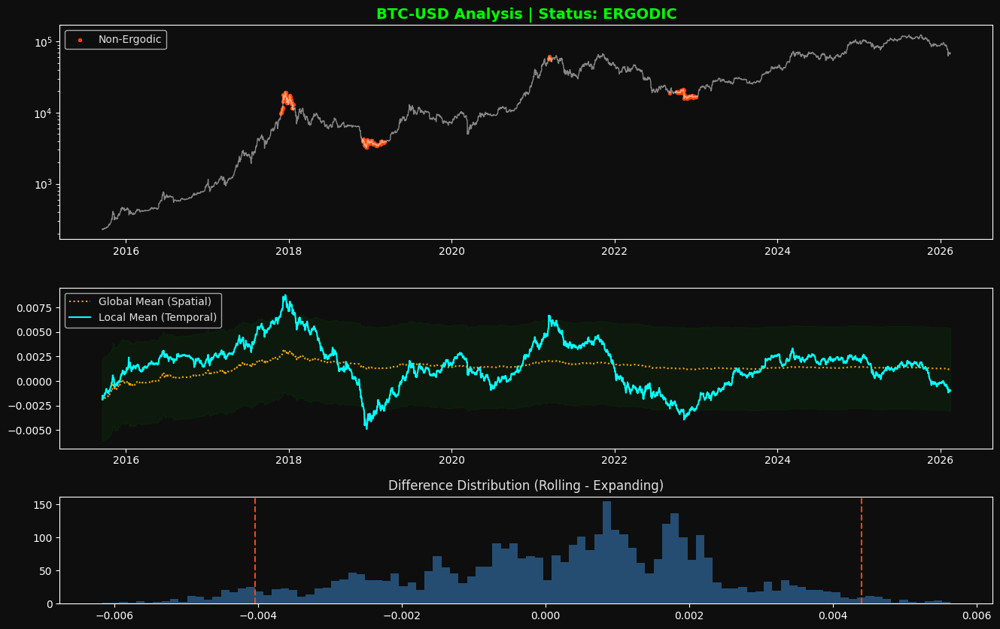

# Market Ergodicity Analysis

This project provides a statistical framework to analyze **Market Ergodicity**. It measures how short-term price behavior (Temporal Mean) aligns with long-term historical performance (Spatial Mean) to identify regime changes and market anomalies.

## Overview: Bitcoin Case Study

By default, the script is configured to analyze **Bitcoin (BTC-USD)**. Bitcoin is a perfect example for this study due to its transition from an emerging high-volatility asset to a more mature financial instrument.

Below is the output generated by the tool using the default settings:



*The red dots highlight "Non-Ergodic" events, where the short-term momentum deviates significantly from the historical average, signaling potential trend exhaustion or structural shifts.*

## How it Works

The analysis is based on the comparison of two different metrics:
1. **Spatial Mean (Expanding):** The cumulative average of log returns from the start of the dataset. It represents the "global" truth of the asset.
2. **Temporal Mean (Rolling):** A 1-year (252 days) rolling average of log returns. It represents the "local" or current behavior of the market.

When the **Difference** between these two exceeds a statistical threshold (±1 Standard Deviation), the market is considered to be in a **Non-Ergodic state**.

## Installation

1. **Clone the repository**:
   ```bash
   git clone [https://github.com/YOUR_USERNAME/market-ergodicity-analysis.git](https://github.com/YOUR_USERNAME/market-ergodicity-analysis.git)
